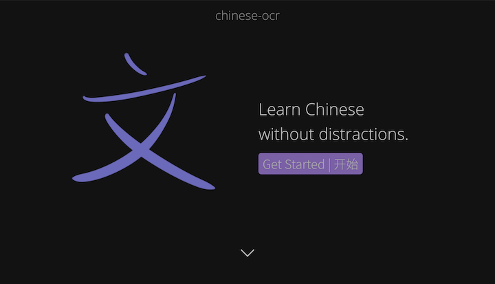

# chinese-ocr
Chinese-ocr is a beautiful web-based [spaced repetition](https://en.wikipedia.org/wiki/Spaced_repetition) flashcard app for learning languages (not just Chinese), complete with handwriting recognition.

This project ticks all the boxes. It's beautiful, efficient, and effective. Most importantly, it provides handwriting recognition that is crucial for learning languages without an alphabet. Chinese-ocr makes the language-learning process more fun and more efficient.


## Webapp
There will be a link to the official deployment here after v1.0 has been released. In the meantime, if you want to get your hands dirty, read on.

### Landing Page



## Built With
* [TensorFlow](https://www.tensorflow.org)
* [Vue.js](https://vuejs.org)
* [Firebase](https://firebase.google.com/)


## Features
* [x] Handwriting recognition
* [x] Spaced repetition flashcards
* [x] Support for more languages


## Quickstart
In the **chinese-ocr-webapp** directory, run the following to quickly spin up a development instance.
```bash
$ npm install        # Installs dependencies
$ npm run twbuild    # Builds Tailwind CSS files
$ npm run serve      # Compiles/hot-reloads dev server
```

### Adding Firebase
To add the backend, create a project in [Firebase](https://firebase.google.com). Copy the JS config snippets from the Firebase console into the `firebaseConfig` in **chinese-ocr-webapp/src/firebase/credentials.js** to add the SDK credentials.
```javascript
export default {
  firebaseConfig: {
    apiKey: "API_KEY",
    authDomain: "AUTH_DOMAIN",
    ...
  }
}
```

### Development
```bash
$ npm run serve      # Compiles/hot-reloads dev server
$ npm run build      # Compiles/minifies -> dist for production
$ npm run lint       # Lints/fixes files
```

### Deployment
```bash
$ npm run devbuild   # Builds, deploys to Firebase Hosting, and removes dist
```


## OCR CNN
Currently, chinese-ocr uses the Google Cloud Vision API to handle handwriting recognition. In the future, we plan to implement custom neural network for better detection of languages not using the Latin script.

The OCR neural network is trained on a 100-class subset of the [CASIA Chinese Handwriting Dataset](http://www.nlpr.ia.ac.cn/databases/handwriting/Home.html). To train on the full dataset effectively, it is necessary to have more training examples per class.

### Obtaining the Dataset
To obtain the full dataset, download [**HWDB1.1train_gnt (2741MB)**](http://www.nlpr.ia.ac.cn/databases/download/feature_data/HWDB1.1trn.zip) and [**HWDB1.1test_gnt (681MB)**](http://www.nlpr.ia.ac.cn/databases/download/feature_data/HWDB1.1tst.zip) and extract the zip files. Store them in the directory **convnet/data** and check that the extracted folders are named **HWDB1.1trn_gnt** and **HWDB1.1tst_gnt**, respectively.

### Preprocessing
Run **convnet/src/preprocess.py** to convert from GNT to png.

### Training
Modify **convnet/src/train.py** to reflect the number of classes you want to train the model on.
```python
model.add(Dense(NUMBER_OF_CLASSES, activation='softmax'))
```

### Prediction
Save an image **convnet/src/test.jpg** that you would like to have the network predict to **convnet/data** and run **convnet/src/predict.py**.


## Contribute
Thank you for reading this far and considering contributing! Contributions are very much appreciated, and they are what makes this project what it is! We are looking for contributions of features/feature requests, bug fixes, documentation fixes, and anything else you can think of! The best contributions are those that will add value to the user experience. If you need to get in touch, please see the [contact/help](#Contact/Help) section.

Please take a look at the information below before contributing. Also, please take a look at the [code of conduct](https://github.com/TanayB11/chinese-ocr/blob/master/CODE_OF_CONDUCT.md). We expect that you follow these standards, and we will enforce them. Please report any violations by sending me an <a href='mailto: tanaybiradar24@gmail.com'>email</a>. 

### Issues
Browse through the [issues](https://github.com/TanayB11/chinese-ocr/issues) or submit one. Here are a couple guidelines to follow:
* Make sure all of your dependencies are up to date
* Include steps to reproduce the issue
* Expected behavior and what went wrong
* Screenshots/terminal output if necessary

### Pull Requests
Pull requests are also always welcome. Here are a couple simple guidelines:
* Make sure your code is readable and commented when necessary
* Document your changes adequately when opening a pull request

### Donations
If chinese-ocr has been of some value to you, and if you can afford it, please consider donating. Donations will always first be allocated to the upkeep of the project. Your donations will also support the development of new features and code maintenance. Here's how you can donate:
* BTC: 15Y9NZjxTLWHDU8kVsqN7FKey3c1RPNiFi
* (We'll add more options soon)

Thank you so much for taking the time to contribute!


## Credits
* [integeruser on Github](https://github.com/integeruser/CASIA-HWDB1.1-cnn)
* [想飞的石头在知乎](https://zhuanlan.zhihu.com/p/24698483)
* [蹦跶的小羊羔在cdsn.net](https://blog.csdn.net/yql_617540298/article/details/82740382)
* [Suragch on Stack Overflow](https://stackoverflow.com/questions/49047159/spaced-repetition-algorithm-from-supermemo-sm-2)


## Contact/Help
If you would like to get in touch with me for any (legitimate) reason, please do not hesitate to 
<a href='mailto: tanaybiradar24@gmail.com'>contact</a> me. If you need more help, please open an issue or send me an email (if an issue isn't appropriate).


## License
This repository is licensed under the MIT License.

[Tanay Biradar](https://github.com/TanayB11)
